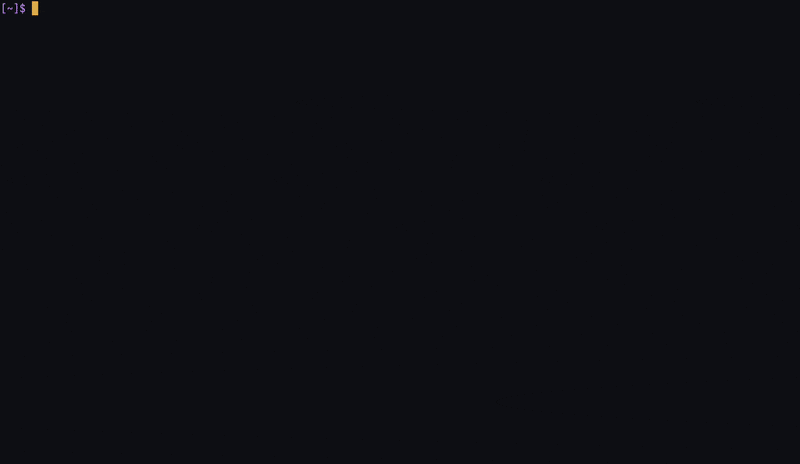

# s3lf

An lf-style terminal browser for Amazon S3. Talks to the S3 API directly
instead of mounting a filesystem



## Features

- Browse buckets and prefixes with lazy pagination
- Vim-style navigation and smartcase search
- Download objects, view in `$PAGER`, edit in `$EDITOR`, or open with the system default
- Conditional GET/PUT on edit using ETag `If-Match` to avoid clobbering changes
- Read-only mode to prevent edits
- Switch AWS profiles without restarting

## Install

```
go install github.com/mbbennis/s3lf/cmd/s3lf@latest
```

## Run

Uses the standard AWS SDK credential chain — `~/.aws/credentials`,
`~/.aws/config`, SSO, env vars, IMDS.

```
s3lf
s3lf --profile prod
s3lf --read-only --region eu-west-1
```

| Flag | Default | Purpose |
| --- | --- | --- |
| `--profile` | env / `default` | AWS profile to start with |
| `--region` | profile's | override region |
| `--read-only` | off | disable delete + edit-save |
| `--download-dir` | cwd | where `y` saves files |
| `--edit-size-limit` | 10 MiB | refuse `e`/`v` above this |

## Keys

Press `?` at any time for the in-app reference.

| | |
| --- | --- |
| `j`/`k` | move down/up |
| `l`/`Enter`/`→` | enter directory |
| `h`/`Backspace`/`←` | go back |
| `gg`/`G` | top / bottom of loaded |
| `R` | refresh listing |
| `/` then `n`/`N` | search (smartcase) |
| `y` | download |
| `v` | view in `$PAGER` |
| `e` | edit in `$EDITOR` |
| `o` | open with system default |
| `D` | delete (type filename to confirm) |
| `P` | switch AWS profile |
| `?` | toggle help |
| `q` / `Ctrl-C` | quit |

`$EDITOR` and `$PAGER` are required for `e` and `v`. No defaults — the
right fallback depends on the user.

## TODO

- File uploads from local disk
- Authoring new files directly to S3 from within the TUI

## Build & test

```
go build ./...
go test ./...
```
